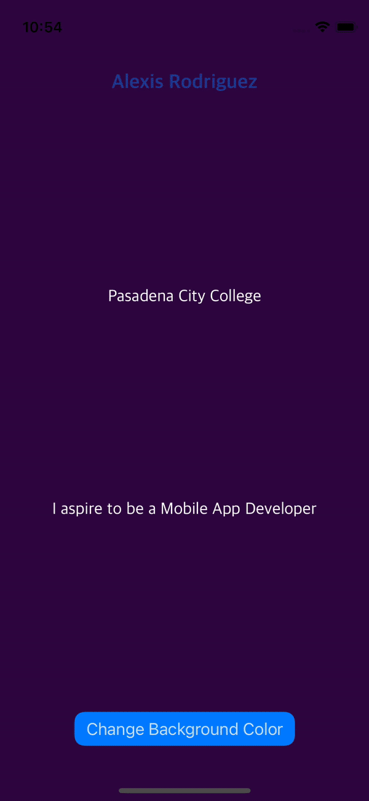

# Prework - *IOS101-Prework-2023*

Submitted by: **Alexis Rodriguez**

**IOS101-Prework-2023** is an app that displays three labels that mention my name, school, and job aspiration. 
  This app also changes the background to a randomized color every time the provided button `Change Background Color` is clicked.

Time spent: **2** hours spent in total

## Required Features

The following **required** functionality is completed:

- [x] Users are see a screen with three labels and a button
- [x] Tapping the button changes the screen color to a random color

## Bonus Features
- [x] Improve the UI by using different a different font
- [x] Used a Stack and AutoLayout to display the labels and button on a wider selection of screens and orientations
- [x] Text color changes every time the background color is changed
 
## Video Walkthrough

Here's a walkthrough of implemented user stories:

<!-- Replace this with whatever GIF tool you used! -->
GIF created with [ezgif](https://ezgif.com/)  
<!-- Recommended tools:
[Kap](https://getkap.co/) for macOS
[ScreenToGif](https://www.screentogif.com/) for Windows
[peek](https://github.com/phw/peek) for Linux. -->

## App Brainstorming (Step 4)

## Notes

Describe any challenges encountered while building the app.

## License

    Copyright [2023] [Alexis Rodriguez]

    Licensed under the Apache License, Version 2.0 (the "License");
    you may not use this file except in compliance with the License.
    You may obtain a copy of the License at

        http://www.apache.org/licenses/LICENSE-2.0

    Unless required by applicable law or agreed to in writing, software
    distributed under the License is distributed on an "AS IS" BASIS,
    WITHOUT WARRANTIES OR CONDITIONS OF ANY KIND, either express or implied.
    See the License for the specific language governing permissions and
    limitations under the License.
